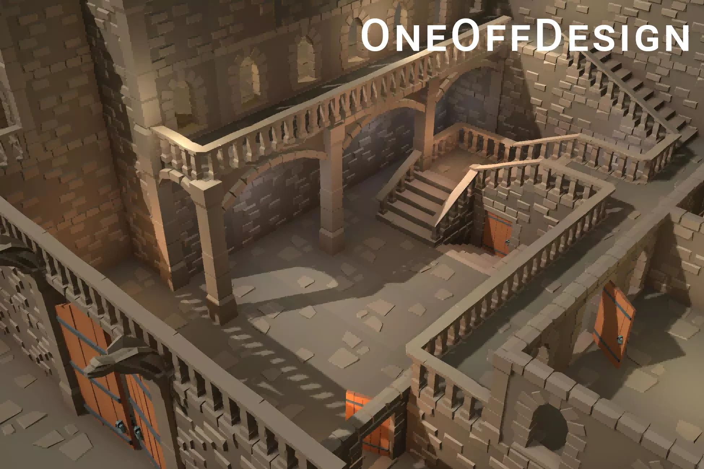

# Game Design Document (GDD) Team - InfiniteStudio.

## Table of contents:

1. [Game Overview](#part-1---game-overview)
2. [Story Narrative](#part-2---story-and-narrative)
3. [Gameplay & mechanics](#part-3---gameplay-and-mechanics)
4. [Level & world design](#part-4---levels-and-world-design)
5. [Art & audio](#part-5---art-and-audio)
6. [UI](#part-6---user-interface-ui)
7. [Technology & tools](#part-7---technology-and-tools)
8. [Team communications, timelines & task management](#part-8---team-communication-timelines-and-task-assignments)
9. [Possible Challenges](#part-9---possible-challenges)

## Part 1 - Game Overview:

### >>> Introduction >>>
 _"MIDNIGHT"_  +++ is a **first prson** survival horror game that takes the player through on a pressing journey to fight for their survival from an awakening boss. The player plays as a hunter of the Catherderal that tracks and pursues undead creatures in the employment of the Council. The longstanding rivilary of two secret organisation have clashed over the centuries. The player's **goal** is to either escape the castle they are trapped in _or_ kill the boss to rid the world of a grave threat. The player will have to explore the castle where they are trapped within, find cues and tools that can help them find ways to get off the island before the monster wakes... What will he find behind the veils of scerecy? Will our dear hunter discover the Council's true intention....?

 >"A Corpose, should be left well alone. Oh, I know very well how the secrets beckon so sweetly. Only an honest death will cure you now. Liberate you from your wild curiosity." 
 -- Lady Maria, Bloodborne

### >>> Core Concept >>> 
Similar to popular survival horror game Bloodborne, ours share significant similarity with Bloodborne in terms of the central theme as a horror game, player goals and motivations. Bloodborne’s core concept of exploration and intricate fights are sources of significant inspirations influencing our game.

  

 However, contrary to Bloodborne’s unique selling points of intricate boss battle mechanics and vast explorable open world environment, our game instead focus more on a claustrophobic environment, with escape and survival as the overarching focus when enemies are swarming in from all directions, pressure and fear is the motivating factor that propels our player’s desire to find the exit.
 
 As a survival horror, our game have its boss wake at 5 mins mark, this timer starts immeidately after the player leaves their spawn room. The following three elements guides the player's path toward the game ending...
 - **Combat RPG:**
 The player must fight more minions & vampires to level up their attack to have a standing chance against the final boss; 
 - **Map exploration:**
 The player must find the boss and subdue it before its awakening; 
 - **Room escape:**
 The player could try to gather cues and find the escape out of the castle before the timer counts down to avoid a final showdown altogether. 

### >>> Target Audience >>> 
The game is intended to be marketed towards young adult players, aged around 18 to 24, who particularly like high pressure horror games. Our game does not boast to have intricate combat system, nor a very deep and explorable map design, but it requires the players to think logically and calmly in face of impending doom, to present players with a set of seemingly impossible tasks, it is up to the player to discover potential pathways, different endings. The decisions they have to make in a split second decides their character’s fate.

### >>> Unique Selling Point >>>
Our game poised itself as a progressively more difficult game, with a carefully designed map that is logical and thoughtful, in its layout as a realistic lair that caters for vampires’ daily operation. Laced with hidden corridors and hints, the game does not have a linear progression path that the player must complete, every monster is optional, including that of the final boss, thereby granting the player a significant degree of control and freedom. The ending, therefore, changes according to the player’s choice of action.
- **intricate & realistic map design:**
the map layout is designed by consulting on real-life medival castle structures, taking inspiration and logical reasoning behind placement of halls, rooms and kitchens. THe distinct separtion between servant and master activity place are indictative of the social hierachy of the old days. Above configurations heightens immersion, creates the environment where the player would feel they are in a real lair of the vampires, rather than a "factory-made" maze.
- **degrees of freedom:**
The are 5 different endings, player's decisions during the game decides which endings they get, since there is no one true storyline, the degree of freedom offered to the player is greater, since this game is a exploration, escape, and combat RPG all melted into one game.
- **Immersive sound and lighting:**
Sound and lightings are critical to create the immersive feeling of a suffocating environment. Dim lit light, with sudden flash of lighting, pouring rain, and ever-intensifying footsteps composes the tension of a survival game, where the walls are closing in on the players. Light and sound are designed to instill fear in the player, empower the game atmosphere with feelings of fear.

--------------------->>>>>>>>>>>>>>>>>>>>>>>>>>>>>>>>>>>>>>>>>>>>>>>>>>>>>>>>>>---------------------------------

## Part 2 - Story and Narrative

### >>> Backstory >>> 
~~~
A forgotten & mystical era, where tales of vampires were not just legends, though only few knew their numbers and whereabouts. Rumors have it that vampires are suspected to have periodically weaved plagues that have decimated millions of peasants over centuries. Their love for wealth and beauty is only superseded lust for blood. Unbearable are the constant tolls the blood plagues exact on the peasants, the state finally gives the directive to find and eradicate vampires. The Cathedral, the capital church of the state, its shadow arm selects the finest of its devotees to become hunters, the sole purpose of the hunters are to seek out undead monsters of any kind and eliminate them, freeing the world from the horrific grip of the blood plagues.
~~~
### >>> Player - Hunter of the Cathedral >>>
####  +++ Design +++ 
Hunter of the Cathedral, lethal actor commissioned to hunt down the last of vampires. Long black clocks symbolize their silent fight against the Council, with a hunting flag as armband. Tall, lean, but well trained, the hunter is master in both tracking and battle techniques. Grey hair, dark eyes, cold expression, tight lips.

####  +++ Concept of the Hunter +++ 

    
  

(source: Bloodborne hunter; **Disclaimer**: placed here as **concept only**, actual model please refer to **demo**)

####  +++ Narratives of the hunter +++ 
~~~
As a hunter commissioned by the Cathedral to investigate an incident in the nation’s south east region, two victims were reported to have succumbed to blood poisoning, suspicious that a vampire might be lurking around and injecting his blood into local wells, the hunter set out to investigate, upon arriving at the town, he was duped and finds himself on an island...

The Hunter found himself unconscious lying in a storage unit, unknown to how or when he was taken to the island. He quickly discovers that the Elder Vampire is set to wake up. Through initial search, he discovered that he is indeed at a lair of an Elder, but strangely, the Elder isn't appear to be active in the castle, he must investigate what is going on... or, should he find a path to leave the castle and report this incident to the Cathedral?

Exploring the castle made the hunter realise that the Elder is indeed waking up, he must either kill the Elder before he wakes, or face its wrath once it has fully awaken. Escape now he might still have the chance to get out alive, but that chance is waning as time draws near for the Elder to wake...
~~~
### >>> Monsters >>>
### Boss - Elder of the Council
####  +++ Design +++ 
A monster of unnatural longevity, and physical powers, residing at an unknown island, wakes up once in a while to start a blood plague. Old man of unnaturally upright posture, seemingly unaffected by his old age. Nimble and cunning. Tall but pale, wrinkled face. Cold and unforgiving, but still maintains the flair of a aristocrat.

####  +++ Concept of the Elder +++ 

    
  

(source: Witcher Elder; **Disclaimer**: placed here as **concept only**, actual model please refer to **demo**)

####  +++ Narratives of the Elder Vampire +++ 
~~~
The Elder is the head of a clan, his is the clan that is responsible for administering blood plagues in the world. Usually sleeps to prolong his life, wakes during the period where blood plagues must be weaved to keep the kingdoms around to not have the excess population that would requires a war...

He was awaken by his underlings, things about a captured hunter, interesting as him could be breaking point to know where the Cathedral is, and gathre intel on their forces. The Hunter is nothing but a petty little fly in the eye of the Elder, always creating more problems than their worth... What will he do with the hunter...
~~~
### Monsters - Vampire offspring of the Elder:
####  +++ Design  +++ 
Family of the Elder, his offsprings, younger monsters of the vampiric blood. Tall, slander. Servants to the Elder, these vampires runs the castle while the Elder slumbers. 

####  +++ Concept of the Vampire +++ 

    
  

(source: Witcher Vampire; **Disclaimer**: placed here as **concept only**, actual model please refer to **demo**)

####   +++ Narrative of the vampires  +++ 
When they are alerted to the fact that the hunter they have captured have been running wild in the castle, they must recapture the hunter. \

### >>> the Council (Flavour text, discoverable in Ending #4:) >>>
~~~
Undead creatures in the service of the Council, composed of various subfactions, each with unique physical traits, the most prominent of which are vampires, powerful undead creatures that haunts the region for centuries, their ancient heritage grants them unfathomable wealth and wisdom. Elder Vampire are heads of branches of blood spawns, master of blood engineering.
Blood plagues are typically ordered by the Council, when the population of the nation rises to such an unsustainable level that starvation is imminent. Vampires under the direction of the Council, infiltrate the cities of major population, unleash plagues the drives the weak and the old into a physical frenzy, as they hunger for blood, they quickly withers, quickly reducing the population of the target city. The plague would then recede, fast as it came. In the opinion of the Council, blood plagues are more controllable, more precise, and relatively quick in its duration then compared to inevitable war that must be waged otherwise to reduce population. Since plagues are heavily engineered to affect those that are weak  in physical stature, the agricultural productivity of the nation would remain mostly unharmed after the plague washes away the excess.
~~~

--------------------->>>>>>>>>>>>>>>>>>>>>>>>>>>>>>>>>>>>>>>>>>>>>>>>>>>>>>>>>>---------------------------------

## Part 3 - Gameplay and Mechanics

### >>> Player perspective >>>
This game is a _first-person horror_ game. Players see the game world through the eyes of the hunter, the player character is not visible on screen similar to how another first person game. Players would be free to move around within the designated area, explore the castle and its surroundings. The camera moves with the player's character.

Players have the agency to move within the boundary of the map, they can move to interact with objects around them, use weapons or items to interact with monsters. The main camera moves with the character, the camera moves with the character the player plays as.

### >>> character.Controls(input) >>>

Controls in this game follow the format of a traditional first-person perspective action game, with additional keys assigned to allow the player to interact with the environment.

#### +++ Character Movement +++
| Keys         | Movement                    |
| ------------ | ---------------------------- |
| W, A, S, D   | Normal Movement: Forward speed exceeds backward speed|
| Spacebar     | Jump: Pressing Shift + Space allows for longer and higher jumps|
|Left Control| Crouch: Moving slowly while crouched. After crouching for 1.5 seconds in a rested or out-of-combat state, enter "Zen Mode," temporarily accelerating life recovery rate to several times its normal rate and proportionally converting stamina into energy. Being attacked or taking any action interrupts Zen Mode. The conversion rate accelerates with the player's level.|
| Shift + WASD|Sprint: Increases the speed limit, eliminates acceleration time (instant speed gain), and allows for quickly pushing aside enemies. It consumes a certain percentage of stamina per second (naturally recovered when out of combat).

#### +++ Character Attack & Interaction +++
| Keys               | Movement          |
| ------------------ | ------------------ |
| E                  | Picking up items or interacting with the environment |
| Left-Click (Mouse)|Normal Attack: Sword; Damage increases with player level. Normal attacks include two sword forms, the upper-left thrust with a lower range, which doesn't consume stamina, and the seated swing, which consumes a small amount of stamina. There's always a chance to trigger a critical hit, swinging around to deal several times the damage of a normal attack. The critical hit rate increases with the player's level. Normal attacks and critical hits share a cooldown, which decreases as the player levels up.|
| Right-Click (Mouse)| _"Extreme Cold"_: Inflicts immediate damage and a lasting ice effect for several seconds, adding a total of 20% continuous frozen damage. During the freeze, the enemy's movement speed, acceleration, and attack speed are all affected. The specific duration depends on the player's casting time, player level, monster level, and monster type. Bosses are significantly less affected by the freezing effect duration compared to regular enemies.|
| Q                  | Ultimate Skill _"Autophagy"_: Inflicts a burst of damage and a mind control effect (lasting several seconds). Monsters will begin attacking other monsters. Burst damage increases with the player's level. In addition to the instant energy cost upon casting, controlling each enemy consumes an additional 2% of the current energy limit, until it's insufficient to control the remaining enemies. Bosses are significantly less affected by the control effect duration compared to regular enemies.            |
| V                  | Whirlwind Kick: Inflicts a significant knockback effect, dealing minor fixed damage, useful for disengaging. Enemies kicked by this ability will fall and then get back up.
| R                  | Golden Bell: Activates with a blue energy cost of 20%. Lasts for d = 7 seconds, providing increased damage resistance (damage reduction ratio, influenced by the player's level). Damage taken is converted into a percentage of energy consumption (equivalent to the resistance-adjusted life loss ratio). The protective effect automatically expires when energy falls below 10%. If Golden Bell is interrupted by the player or external factors, the remaining energy is returned proportionally. Golden Bell can effectively block ranged attacks from normal monsters and reflects them back, causing damage that scales with the player's level. For bosses, there is a significant reduction in the duration of control and freezing effects.
| C                  | Meadow Meteor: Fires several sword energy waves, akin to meteors streaking across the field. The number of waves increases with the player's level. Although it can snipe targets at a distance in lower levels, it is more cost-effective against medium and close-range enemies. If it gets too close, dealing excessive damage to one or two targets may result in overflow damage. Affected by cultivation.
| G                  | Persistent Reverie: Aggregates mana (extremely high energy consumption) to create an energy ball, which can bounce between nearby enemies after hitting the initial target. Damage diminishes by 20% with each bounce. This spell rewards the player with enemy-specific experience points for each enemy hit, which comes to effect when the energy ball disappears.
| F                  | Fire: Hold F to select a landing point and release it. Inflicts a delayed damage over time to each individual entering the area, with stacking effects on the same target. If it exceeds the casting distance, the spell cannot be released, and releasing the key returns the energy. Affected by cultivation. Fire is most effective at eliminating groups of enemies and has low energy consumption, making it the preferred choice against numerous low-level enemies. However, its AOE damage becomes less relevant in the final battle.
| ~                  | Tilde (~): If confident enough, you can initiate a boss battle early (generally not recommended).
| Del                | Delete (Del): Cheat mode (enable when the game becomes too difficult), during which the experience level-up mechanism is disabled, and each press of the "L" key increases the level by 10.
| ESC                | Escape (ESC): In-game pause/continue key, which brings up the menu for restarting or exiting the game.
| TAB                | Tablet (Tab): Display and hide control key prompts in the game.

###  Progression
[progression-flowchart](https://lucid.app/lucidchart/55ee7a9d-d9f5-43fc-b5c5-850204bcdba9/edit?invitationId=inv_106fb1f4-d21d-4cf0-a028-4dd347ed82b0&page=0_0#)

###  >>> Story progression >>>
~~~
Game starts as the player finds himself locked in a room, they must solve a mini puzzle to escape the room. Along the way, they could choose to pick up a weapon to fight, or find exits that can lead them to safety. The player has to explore the castle and its surroundings to find something that can get them off the island before the Elder awakens. Players must fight off the vampire offspring they encounter throughout the run, they must not get bitten.

The Elder vampire wakes in 4 minutes, in this time, the player could just eliminate a defenceless Elder, however, this option is unbeknowest to the player, which is only discoverable once the player found the Elder before the timer is up. Players can choose to eliminate the Elder in his weakened form, where if the player finds Elder before the timer is up, but choose not to attack the Elder, the later will reveal the history of the Council, the motivations behind each blood plague.

Should the player fail to find the Elder before he wakes, they must fight the Elder to the death to keep their freedom. The boss fight will occur whenever the countdown is over, the player will be teleported into the boss room. If the player loses his battle, he will become another mini-vampire. Should he win, he gets to choose to leave the island or ascend as the next Elder by absorbing the Elder's blood. 
~~~
### >>> Gameplay Progression >>> 

#### +++ *Exploration* +++ 
As the game progresses over time, the player must explore more of the castle, giving players the opportunity to find items to enhance their combat abilities, fight against randomly generated monsters to strengthen themselves, or directly find the exit key to escape. 

####  +++ Combat +++ 
Player's character engages in battle with a limited health bar; when their health bar drops to zero or below, it is gameover. Monster's health bar increase over time.

When the player decides to engage in battle with vampires, they must first possess a weapon, the player can use the weapon to damage target monsters, when they have dealt enough damage to render an enemy's health bar below zero, the enemy will explode into a small pool of blood.

####  +++ Combat strategies +++ 
Once engaged in battle, players must finish the battle as quickly as they can and relocate themselves to avoid being ganged upon by other vampires attached to the battle location. As vampires spawn at an increasing rate, players could find themselves inevitably overwhelmed if they linger too long, thus forcing players to either eliminate vampires methodically or seek the escape path. Engaging in combat will attract more vampires to the player's location. Vampire Spawn at an increasing rate.

####  +++ End Games... +++ 
If players fail to eliminate enough mini-vampires to increase their character's attack power before the Elder wakes, they will find themselves weak against the awakening Elder. If the game progresses to five minutes (meaning the player has not found the exit key), the Elder will awaken. Should the player not have found the escape path before the timer expires, players must confront the Elder head-on. If the player is defeated by the Elder, they lose, but if they defeat him, they win. They also win if they manage to find the exit before the Elder awakens.

### >>> Gameplay mechanics >>>

This game follows the classic first person RPG suite of features, weapons, healthbars, mobs, bosses. Mob spawns from fixed locations, different mobs spawn from different locations, however boss only spawns from a fixed location, player could discover the boss before he wakes, thereby avoiding the final fight.

#### +++ Monsters system +++
This system governs the spawn rate, spawn time, and spawn frequency of minions and the final boss. It also sets forth rules for how spawned minions will patrol the castle searching for the player, pathing, and other attributes.

| component         | responsibility                                |
| ----------------- | ---------------------------------------------- |
| Monster spawning  | spawning location, spawn frequency, spawn type |
| Monster pathing   | guides monsters towards the player, patrol the castle |
| Monster attack    | controls the monster's attack pattern          |

Minions will begin to spawn from their respective locations. Weaker minions will spawn from the kitchen, while stronger minions will spawn from the bedrooms. The stats of the minions will increase as game time progresses. These stats include health, movespeed, and size. Stronger minions will only begin to spawn after the player has killed their first minion; otherwise, minions will spawn at a higher rate if the player does not kill a minion within the first minute.

The boss spawns after a 5-minute timer expires if the player had not eliminated the dormant form of the boss or escaped from the castle. After the boss spawns, the player will be teleported to the boss room, and the boss room and its immediately connected rooms will be available to move while the player battles the boss. All other exits are locked until the boss is defeated or the player loses the battle.

The boss is also considered as a monster.

#### +++ Battle system +++
Players can battle minions they encounter, and the battle mechanics are controlled by the battle system. The battle mechanisms are simple: the player and enemies hack each other to pieces until one side's health is reduced to zero.

Damage Mechanics:

| component  | responsibility                                |
| ---------- | ---------------------------------------------- |
| dmg        | governs damage calculation from attacks that connect |
| knockback  | governs on-hit physical feedback strength and delay |

Damage calculation: `damage = attack - armor`

#### +++ Character system +++
Character stats:

This component controls health, attack, and armor of any character, consistent with any RPG game. However, this game has drastically simplified the number of attributes for simplicity's sake. These attributes are almost self-explanatory, leveraging the user's existing mental models from past RPG games they have played, allowing them to quickly gain an intuitive grasp of the core game mechanics.

| component  | responsibility             |
| ---------- | --------------------------- |
| health     | stores healthbar information |
| armor      | stores damage mitigation    |
| damage     | stores how much damage attacks from this character do |

#### +++ Equipment system +++
The player can leverage various items scattered around the castle to gain a boost of effects.

| component  | responsibility        |
| ---------- | ---------------------- |
| items      | item effect and description |
| abilities  | governs player ability functionalities |

####  +++ Other +++

**Freezing:**

- Both players and monsters can be frozen.
- Players' attack speed is not affected by freezing, unlike the movement + Attack speed penalty for monsters.

**Cultivation:**

- Some skills' strength increases with usage.
- Players need to make choices when casting skills.
- Overusing AOE (Area of Effect) skills may render single-target skills ineffective against bosses.
- Single-target or control skills have their own limitations.
- Players must explore different gameplay strategies.

**Levels:**

- Both players and monsters have corresponding levels.
- Many in-game interactions between attack and defense are based on levels.
- The core gameplay and goal revolve around leveling up.
- Monster levels depend on the time of their appearance.
- Having a lower level compared to monsters is deadly for players.
- The game's success is largely determined by the level and the degree of skill cultivation.

**Obstacle Blocking:**

- All projectile spells are blocked by obstacles.
- Summoning spells, like fireballs, can be cast on both sides of obstacles. But initial casting must target the obstacle itself to allow casting.

**Pathfinding and Creep Accumulation:**

- All monsters pursue players regardless of distance.
- Hiding is rarely a good option.
- Gaining an early-level advantage at the beginning of the game is recommended.
- Eliminating low-level enemies is not difficult, but efficiently killing them within a limited time requires some skill.

## Part 4 - Levels and World Design

Game visual is 3D based, the player perspective is similar to that of first person shooter. Map design is flat with only one level and one map. The game adopts a war fog and limited field of view, and players have a small navigational map.

### >>> Map Design >>>
A two stage development process is followed, the first stage creates a traditional castle that contains the necessary living space for the vampire family, which would also include a boss room. The second stage is the expansion, where more lore-based settings will be explored to increase the flavour of the game, adding to the immersion.

#### +++ Stage 1 +++

    

(Map: [castle layout](https://lucid.app/lucidchart/a4aa4f39-a2ca-41cd-9aba-a0a8643d0b69/edit?viewport_loc=-6581%2C-912%2C13217%2C5291%2C0_0&invitationId=inv_f9e4d67f-d6b5-4315-ad86-f823718a01fd))\
Stage 1：The map consists of a castle. The castle is located centered in the map. The castle is an imitation of a typical medieval style castle. The layout consists of two parts, the guest rooms and private rooms. Each section has their own entrance, however, they are interconnected through main corridors or secret corridors.
Monsters spawn from fixed locations, the stronger spawn from private bedrooms and main residences, while weaker mobs spawn from the kitchen or the balcony. 

#### Stage 1 development notes 05/10/23 ####
Base scene: [Slavic medieval environment](https://assetstore.unity.com/packages/3d/environments/fantasy/free-slavic-medieval-environment-town-interior-and-exterior-167010). 

  

**Game Scene**: Utilising the starting scene in the base pack to serve as the foundation. The town across the river is removed entirely, foundation is paved and a castle is erected on the premise.

**Statics castle**: it is decided most walls and furniture remains statics. While static furnitures reduce the level of environment responsiveness and interactiveness. There is a concern that it could negatively impact the combat experience if furnitures flying around would act as distraction rather than feature.

**Flat design**: The castle is without different levels, given that the game is only 5 mins, a flat level design would add less mental strain to the player, if they have to remeber what level they are on, which corner they turned before, and which they should take next, it is not our intention to build a labyrinth.

One of the asset packs we used offer stairs and long hallways. Considerations arise that because player character is not the only characters that will be passing through, if the hallway is culstered with hoards of minions, it could create a blockage where the player could neither move forward or backward, thereby have zero counter play possible, and that would not be fun or engaging.

  

**interior lighting**:
One of the biggest problem we've had is with interior lighting, too bright and it loses the horror feel, and too dark means the player could not see the pathway clearly. It remains a challenge to have the right amount of light sources per room and at the right level of intensity.

Furthermore, we intend to have light that ebbs and flows a bit to add a sense of time flow to the game, current concern is the added load might cripple fps, leading to a quite laggy suituation.

**pathing**: While we designed the map to be open world, we still intend the player to explore as much of the castle as they can, therefore rooms in the castle are connected, sometimes with corrdiors connecting them. If the player want, they could even exit the castle and fight in the island, if that is their wish.

#### +++ Stage 2 +++
Stage 2: (if development time allows), a second floor is planned with more intricate pathing, more living space open for exploration. The second floor will be expansion upon the traditional castle, it will be a underground floor with rooms dedicated to the use of blood engineering.
* prisions 
* plague rooms
* torture rooms 
* storages spaces

### >>> Objects >>>
Objects are categorized into different groups: environment, enemies, and player objects.

#### +++ Environmental +++
Environmental objects, primarily doors, walls, and fixed decorative components, serve as the foundational elements of the main scene. These objects help shape the game world and provide the backdrop for player interactions. Players have the ability to interact with certain environmental objects to influence gameplay. The environmental objects include:

| objects        | description                                              |
| -------------- | -------------------------------------------------------- |
| wall           | Non-interactive, basic building component.               |
| sofa           | Non-interactive, basic building component.               |
| cabinets       | Non-interactive, basic building component.               |
| plants         | Non-interactive, basic building component.               |
| bed            | Non-interactive, basic building component.               |
| sink           | Non-interactive, basic building component.               |
| mirror         | Non-interactive, basic building component.               |
| plants         | Non-interactive, basic building component.               |
| plants         | Non-interactive, basic building component.               |
| doors          | Interactive, basic building component that connects rooms and corridors. |
| holy spring    | Interactive, mystical fountain that restores the player's magical power when bathed in. |
| demonic hearth | Passive-triggered, infernal fireplace that emits malevolent flames, endangering any nearby players. |

#### +++ Enemy objects +++
Enemy objects includes the model of the boss, monsters and minions.
Special enemy objects includes the boss coffin, which the player could directly attack before the boss is spawn, destorying this will also destory the boss, leading to end of the game.

| objects     | description                                     |
| ----------- | ----------------------------------------------- |
| boss        | body model of the boss                         |
| boss coffin | container of boss before he wakes, attack this to kill the boss |
| monster     | body model of the monster                      |
| minion      | body model of the minion                       |
| blood       | enemy projectiles                              |

#### +++ Player objects +++
Player objects, mainly the body of the hunter.

| objects | description     |
| ------- | --------------- |
| hunter  | hunter body     |

#### +++ interactive equipments +++
Interactive equipment items scattered throughout the castle that the player can interact with. These objects have the potential to significantly impact the player character's stats and abilities.

| objects              | description                                             |
| -------------------- | ------------------------------------------------------- |
| sword                | Weapon that enables the player to launch attacks.       |
| armour               | Armour pack that enhances the player's damage mitigation. |
| blood pack           | Health pack used to replenish the player's health bar.   |
| holy light incantation | A pickable item that bestows specific attribute enhancements to the player (e.g., attack, shield, movement speed, etc.). |
| knowledge's gaze     | A pickable item that grants the player clairvoyance, allowing them to perceive enemies within a certain range. |
| mysterious Peachwood Sword from the East | A pickable item that wards off evil, causing nearby non-boss enemy units to have a chance to refrain from attacking and instead follow the player. |
| grasp of the wormhole | A pickable item that instantly teleports the player to a random location on the map, providing an escape strategy (though the new location may not guarantee safety). |
| guardian angel       | A pickable item that summons two indestructible angelic minions to assist in battle for 30 seconds. |

### >>> Physics Mechanics >>>
The fundamental physics mechanics integral to this game encompass collision detection, knockback calculations, and the inclusion of gravity mechanics. These mechanics will facilitate a comprehensive understanding of the interactions between players, monsters, and the game environment.

#### +++ Battle Mechanics +++
The core physics mechanics upon which this game relies are collision detection and knockback. These foundational components underpin the game's realistic combat feedback system, offering players immediate responses to successful attacks and incoming enemy strikes. This system is composed of the following elements:

- **Collision Detection:**
    - Detects instances when a player comes into contact with an enemy or when weapons make contact with objects possessing health bars.

- **Knockback:**
    - Initiates knockback effects when an enemy or player is struck, with the intensity of the knockback determined by the attack's strength.

However, it's worth noting that recent developments in the game's design have led to the introduction of additional physics elements:

- **Projectile-Based Magic Skills:**
    - The game's skill system may now allow players to utilize projectile-based magical abilities. This introduces a new layer of complexity to the physics engine, as it involves tracking the trajectory and behavior of magical projectiles.

- **Jumping and Climbing Mechanics:**
    - Characters in the game now possess the ability to jump to limited heights, climb walls, and briefly evade damage or seek escape during combat. As a result, a gravity system has been integrated for both characters and monsters to account for these actions.

- **Advanced Attack Mechanics:**
    - In certain circumstances, standard attacks may involve wielding weapons, potentially employing dynamic field-of-attack-based collision detection for more realistic combat interactions.

- **Shield Blocking Mechanism (Pending Development Progress):**
    - Depending on the progression of development, a shield equipment mechanism, akin to the field-of-attack-based collision detection, may be introduced to enhance the authenticity of shield blocking.

These additions to the physics mechanics enrich the gameplay experience, creating a dynamic and engaging environment for both players and monsters.

### Part 5 - Art and Audio

## Art Style

The game's art style blends gothic and steampunk aesthetics to create a dark and mysterious atmosphere that reflects a forgotten and mysterious era. The game's visuals feature intricate details, ornate architecture, and a sense of decay. The game's color palette consists of deep and rich tones such as burgundy, midnight blue and deep emerald, coupled with metallic shades such as bronze and rusty gold. The shapes used are delicate and beautiful, with pointed arches, intricate carvings and delicate filigree. A variety of textures, including weathered stone, polished wood and worn leather, enhance the tactile feel of the world.

Visual style: given the dark and mysterious times, consider a rich and detailed art style that captures the eerie atmosphere.  gothic and Victorian aesthetics can be good sources of inspiration.

Character design: design unique characters for hunters and older vampires.  hunters can have a rough and battle-hardened look, while older vampires can exude grace, elegance, and power.

Environment design: create diverse environments ranging from cobblestone old towns to creepily beautiful cathedrals.  These settings should evoke a sense of history and legend.

Lighting and ambience: use lighting to set the mood.  dimly lit areas, flickering candles, and scary shadows can add to the tension and mystery of the game.

Creature design: design unique features for the various undead creatures in the different chapters.  make them visually unique and intimidating.

###  >>>  Sound and Music  >>> 

The sound design complements the visual style, immersing the player in a haunting and intense auditory experience. Sound effects include echoing footsteps on the cobblestones, distant howls, and the creaking of ancient doors. Ambient sounds such as the rustling of leaves and distant whispers enhance the eerie atmosphere. The music is orchestral and dark, including soothing strings, haunting choir songs and eerie melodies. In tense moments, the music swells up and creates tension, while in quieter moments, the music gives a sense of melancholic reflection.

Soundtrack: Set the game to evocative ambient music that complements the atmosphere of the game. Use orchestral or ambient music to create tension, excitement and mood.

Sound effects: Create a variety of sound effects for actions such as footsteps, combat, magic, and environmental interactions. These subtle details enhance realism and player immersion.

Voiceovers: Consider adding voice overs for key characters to deepen their personalities. Voice Overs can bring the narrative to life and make characters more relatable.

#### +++ BGM +++
[BGM-1](http://sndup.net/vmg8)\
"In the midst of an eerie silence, the sounds of 'Dancing Monster' emerge with both playful motifs and a creepy atmosphere. As the rhythm unfolds, one can imagine a creature of the night, perhaps a monster, doing a grotesque dance. The melody carries a sense of mischief, reminiscent of a creature reveling in the moonlight. However, underneath the dance-like rhythm lurks a threatening tone, a reminder of the monster's true nature. The lightheartedness blends with the fearful tone to create a captivating soundscape that draws the listener into a dance where joy and danger intertwine.

[BGM-2](http://sndup.net/vsbz)\
When a "scary_horror_sound" begins, an ominous sense of foreboding immediately envelops the listener, painting a vivid picture of desolation and terror. A low whisper, long forgotten, permeates the atmosphere, echoing in the dark corners of the imagination. Every nuance is a reminder of danger, invisible to the eye but felt with every heartbeat. Hollow sounds in the distance hint at unseen movement, and deep, rumbling tones suggest the presence of evil.

[BGM-3](http://sndup.net/jdfs) \
A strong sense of dread and suspense pervades, with ghostly whispers and eerie undertones painting a dark, creepy scene. But as the track progresses, the mood shifts. The disturbing noises begin to subside, giving way to a serene and tranquil atmosphere. This serene ending contrasts with the horror that preceded it, evoking discovery and hope. It's as if, in the midst of shadows and fear, the player stumbles upon the beacon of salvation - the coveted sword. This soundscape seamlessly transitions from sheer terror to gentle calm, reflecting the player's journey from danger to hope.

###  >>>  Assets >>> 

Here are some easy-to-display materials. For a complete list, see the Reference and External Sources topic in report.

#### +++ Scene +++

**Currently in use assets**：

[Simple Fantasy Interiors - Cartoon Assets](https://assetstore.unity.com/packages/3d/environments/fantasy/simple-fantasy-interiors-cartoon-assets-76478):

This is the primary castle interior decor material, all furnitures used originate from this asset package.

  

[Low Poly Dungeons](https://assetstore.unity.com/packages/3d/environments/dungeons/low-poly-dungeons-176350): 

This package was used in providing some furnitures not included in the first pack.

[Lowpoly Castle Dungeon Tileset](https://assetstore.unity.com/packages/3d/environments/dungeons/lowpoly-castle-dungeon-tileset-195730)

[FREE Slavic Medieval Environment Town Interior and exterior](https://assetstore.unity.com/packages/3d/environments/fantasy/free-slavic-medieval-environment-town-interior-and-exterior-167010)

- Lowpoly Castle Dungeon Tileset(Lowpoly)
  

    

      
      
    

  

#### +++ Character +++

- Monster_4 low-poly
  

    

      
    

  

#### +++ assets for UI +++ 

- RPG Unitframes #1 — POWERFUL METAL

    
  

## Part 6 - User Interface (UI)

User interface includes health bar, menu, and minimap, weapon, message board.

- The health bar displays the player's current hit points and mana.
- Menu: would include options for checking playtime, pausing/resuming gameplay, adjusting media settings, and exiting the game.
- Minimap: a birdview projection of player location that displays the approximate topography and terrain near the player's current location to provide a sense of direction in the game while maintaining immersion and a feeling of being lost, in order to preserve the core elements of the horror game.
- Weapon: as the medium for character attacks, will appear in a first-person perspective on the screen, and it will trigger various effects as the character initiates attacks or uses skill moves.
- Message board: a general Affairs Bulletin Board, notifying players of item pickups, ability upgrades, remaining time, and all unexpected in-game events.

## Part 7 - Technology and Tools

The game is developed using Unity 2022.3.5f1 LTS version, with commonly used C# code editors such as Visual Studio, Visual Studio Code, Jetbrains Rider. Regarding Unity's internal technologies, the plan includes utilizing Cinemachine in conjunction with custom scripts to control the camera, employing the Rigidbody FPS Controller for player character movement and interaction, and integrating A* Pathfinding Project Pro or similar pathfinding algorithm plugins to facilitate pathfinding for non-player characters. Additionally, Unity Audio Mixer will be employed to achieve precise control over various audio elements including environmental sound effects, music, and sound effects.

## Part 8 - Team Communication, Timelines and Task Assignments

### >>> Team Communication >>>
We have agreed to adopt a multi-faceted team collaboration approach. This includes: using Wechat group chats for general communication, utilizing Google Docs to record shared GDD (preliminary) and troubleshooting (development phase), planning progress and assigning tasks using Trello boards, hosting code in a GitHub repository, sharing local folders or assets as needed through Google Drive or Onedrive, and conducting regular communication and progress alignment through Zoom or voice meetings.

Our current plan involves an agile approach, continuously adjusting and dividing work as we progress. We set weekly delivery goals, strive for an even distribution of tasks, regularly merge code into the main branch, break down logic, and develop individual unit behaviors and unit-environment interactions as independently as possible. Interactions between units are coordinated and accomplished through pairwise discussions and collaboration among the involved team members.
#### +++ Trello Board +++
[link to board](https://trello.com/invite/b/ntbln1hq/ATTI8c7d1d32835f1e709cb837b8990aa92e1FA41169/graphics)

#### +++ Meeting schedule +++
Schedule: Meeting, once per week, usually at the end of the week. Meeting topics as follows. Meeting tasks updated to trello.
Wk2: set game plot, game story, and design direction.
Wk3: distribute tasks, research and unity testing.
Wk4: began drafting GDD, distribute parts.
Wk5: revision on last week's work, looking at gaps in GDD.
WK6: further testing on unity assets, feasibility concerns.

### >>> Timelines >>>

### +++ Preparation +++ 
#### Step 1. Game Design and Concept

- 1.1 Game Design Document Formulation
  - Create a detailed game design document outlining gameplay, levels, characters, and the story.
- 1.2 Concept Art and Character Design
  - Commence concept art and character design to establish the visual style of the game.

#### Step 2. Project Tool Setup

- 2.1 Project Management Tool Setup
  - Establish project management tools such as Trello boards or Jira for task allocation and progress tracking.
- 2.2 Version Control System Implementation
  - Create a GitHub repository and set up the version control system.

###  +++ Began Foundational Game Development +++ 

#### Step 3. Establishment of Basic Game Framework

- 3.1 Game Engine Fundamental Framework
  - Develop the foundational framework of the game engine, including player controls, camera systems, and the physics engine.
- 3.2 Design of the First Game Level
  - Design and model the first game level, including room layouts and item placements.
- 3.3 Player Character Control
  - Implement basic player character control, including movement, jumping, aiming, and shooting functionalities.

###  +++ Expansion of Gameplay content +++  (skip if insufficient development time)

#### 4. Expansion Design

- 4.1 Expansion of Game Maps
  - Expand the game maps, creating multiple levels and rooms, progressively increasing game difficulty.
- 4.2 Mission and Storyline
  - Introduce missions and storylines to guide player progression and provide insight into the game world's backstory.
- 4.3 Enhancing Enemy AI
  - Improve enemy AI to enhance challenge and diversity.
- 4.4 Design of Items and Weapons
  - Create additional items and weapons, enhancing player strategic choices.
- 4.5 Introduction of Horror Elements
  - Design and implement horror elements, including sound effects and visual effects.

###  +++ Game Testing and Optimization +++ 

#### 5. Internal Testing

- 5.1 Functional Testing
  - Conduct functional testing of all game features, including player control, enemy AI, physics engine, and more.
- 5.2 Level Testing
  - Ensure the playability and balance of each game level.
- 5.3 Horror Element Testing
  - Verify the effectiveness of horror elements, gathering player feedback.

#### 6. Optimization

- 6.1 Performance Optimization
  - Optimize game performance to ensure smooth gameplay.
- 6.2 Bug and Issue Resolution
  - Address in-game bugs and issues to enhance stability.
- 6.3 User Interface Refinement
  - Improve the user interface to enhance the overall user experience.

## Part 9 - Possible Challenges
1. Game Balance \
Balancing game mechanics by designing monster appearances and chase paths to ensure the game is neither too easy, making it boring, nor too difficult, leading to a loss of interest. This also includes ensuring map complexity and diversity to give players a good gaming experience.
2. Character Art Design \
Finding visually consistent materials and tones to ensure all in-game elements (environment, characters) share a cohesive visual style. Also involves seamlessly integrating horror elements into the game while ensuring high character recognizability to easily resonate with players.
3. Version Control and Collaboration \
Code conflicts may arise during multi-person collaboration within the team. Code reviews are necessary to ensure all submitted code is of high quality. Frequent and effective team communication is crucial, as is meticulous consideration of the impact of adding, deleting, or modifying code on the overall project.

