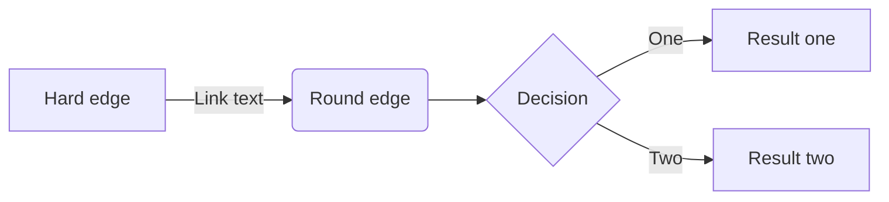

[](https://classroom.github.com/a/0n2F_Zha)
# Game Design Document (GDD)

Read the [project specification](https://github.com/COMP30019/Project-1-Specification) for details on what _actually_ needs to be covered here. While you should (obviously) delete everything here and replace it with an actual GDD before submitting your project, you may wish to keep a copy of it as a cheat sheet for how to use "GitHub flavoured markdown".

Ensure that _your game design document_ is `well written` and formatted **appropriately**. 
Below are examples of markdown features available on GitHub that might be useful, though this is not an exhaustive list, nor is it required that you use all of these features.

### Table of contents
* [Introduction](#introduction)
* [Emojis and Icons :boom:](#emojis-and-icons)
* [Using Images](#using-images)
* [Code Snipets](#code-snippets)
* [Tables and Lists](#tables-and-lists)
* [Maths and Diagrams](#maths-and-diagrams)
* [References](#references)


### Introduction
_Exciting title_ is a first-person shooter (FPS) set in... we're not sure yet. It's a bit like _Doom_ meets _Animal Crossing_, but with a twist. The player must... 

> "This is a quote from the game designer, explaining why this game is going to be the best thing since sliced bread." - Game Designer

### Emojis and Icons

Check out [this page](https://github-emoji-picker.rickstaa.dev/) for a list of emojis/icons that you can use in your markdown. For example, you can use :sparkles: to make things sparkle! Use them sparingly and selectively, as too many emojis can be distracting, and some aren't super appropriate for a GDD. :wink: :wink: :wink:

### Using Images

Remember that your GDD should be a very visual document! It's easy to include images or gifs in your markdown, like this:

<p align="center">
  
</p>

### Code Snippets 

Code is unlikely to be needed much (if at all) in your GDD, but it's still handy to know how to embed it. If you do include any `code snippets`, be sure to explain them properly.

```c#
public class CameraController : MonoBehaviour
{
    void Start ()
    {
        // Do something...
    }
}
```

### Tables and Lists

You can create tables using markdown, though it's a bit fiddly and not super customisable. Here's an example:

| Column 1 | Column 2 | Column 3 |
| -------- | -------- | -------- |
| Row 1    | Row 1    | Row 1    |
| Row 2    | Row 2    | Row 2    |
| Row 3    | Row 3    | Row 3    |

You can also create lists, like this:

* Item 1
* Item 2
* Item 3

Or like this:

1. Item 1
2. Item 2
3. Item 3

Or even nested lists like this:

1. Item 1
    * Item 1.1
    * Item 1.2
2. Item 2
    * Item 2.1
    * Item 2.2


### Maths and Diagrams

Like code, maths probably won't feature much in your GDD, but it's worth knowing that you can use LaTeX to write equations, and have them automatically render in your markdown:

$$\left( \sum_{k=1}^n a_k b_k \right)^2 \leq \left( \sum_{k=1}^n a_k^2 \right) \left( \sum_{k=1}^n b_k^2 \right)$$

... [look here](https://docs.github.com/en/get-started/writing-on-github/working-with-advanced-formatting/writing-mathematical-expressions) if you want to learn more about this.

It's also possible to [create diagrams](https://docs.github.com/en/get-started/writing-on-github/working-with-advanced-formatting/creating-diagrams) via GitHub flavoured markdown using an integrated tool called Mermaid. This is a pretty powerful tool, and it's worth checking out [this](https://mermaid.js.org/intro/) guide for more information on what it can do. As a quick example, here's a flowchart:



Pretty neat, huh? You can also create sequence diagrams, Gantt charts, class diagrams, and more. Check out the [Mermaid Live Editor](https://mermaid-js.github.io/mermaid-live-editor/) to see what's possible.

### References

Need more help? Check out these resources, which everything in this document is based on:

* [GitHub Flavoured Markdown](https://guides.github.com/features/mastering-markdown/) (official guide)
* [GitHub LaTeX](https://docs.github.com/en/get-started/writing-on-github/working-with-advanced-formatting/writing-mathematical-expressions)
* [GitHub Diagrams](https://docs.github.com/en/get-started/writing-on-github/working-with-advanced-formatting/creating-diagrams) 
* [Mermaid Docs](https://mermaid-js.github.io/mermaid/#/)
* [Mermaid Live Editor](https://mermaid-js.github.io/mermaid-live-editor/)
* [Emoji Picker](https://github-emoji-picker.rickstaa.dev/)
