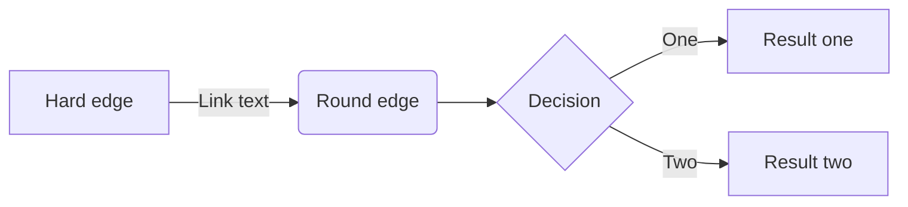

[](https://classroom.github.com/a/0n2F_Zha)
# Game Design Document (GDD)

Read the [project specification](https://github.com/COMP30019/Project-1-Specification) for details on what _actually_ needs to be covered here. While you should (obviously) delete everything here and replace it with an actual GDD before submitting your project, you may wish to keep a copy of it as a cheat sheet for how to use "GitHub flavoured markdown".

Ensure that _your game design document_ is `well written` and formatted **appropriately**. 
Below are examples of markdown features available on GitHub that might be useful, though this is not an exhaustive list, nor is it required that you use all of these features.

### Table of contents
* [Introduction](#introduction)
* [Emojis and Icons :boom:](#emojis-and-icons)
* [Using Images](#using-images)
* [Code Snipets](#code-snippets)
* [Tables and Lists](#tables-and-lists)
* [Maths and Diagrams](#maths-and-diagrams)
* [References](#references)


### Introduction
_Exciting title_ is a first-person shooter (FPS) set in... we're not sure yet. It's a bit like _Doom_ meets _Animal Crossing_, but with a twist. The player must... 

> "This is a quote from the game designer, explaining why this game is going to be the best thing since sliced bread." - Game Designer

### Emojis and Icons

Check out [this page](https://github-emoji-picker.rickstaa.dev/) for a list of emojis/icons that you can use in your markdown. For example, you can use :sparkles: to make things sparkle! Use them sparingly and selectively, as too many emojis can be distracting, and some aren't super appropriate for a GDD. :wink: :wink: :wink:

### Using Images

Remember that your GDD should be a very visual document! It's easy to include images or gifs in your markdown, like this:

<p align="center">
  
</p>

### Code Snippets 

Code is unlikely to be needed much (if at all) in your GDD, but it's still handy to know how to embed it. If you do include any `code snippets`, be sure to explain them properly.

```c#
public class CameraController : MonoBehaviour
{
    void Start ()
    {
        // Do something...
    }
}
```

### Tables and Lists

You can create tables using markdown, though it's a bit fiddly and not super customisable. Here's an example:

| Column 1 | Column 2 | Column 3 |
| -------- | -------- | -------- |
| Row 1    | Row 1    | Row 1    |
| Row 2    | Row 2    | Row 2    |
| Row 3    | Row 3    | Row 3    |

You can also create lists, like this:

* Item 1
* Item 2
* Item 3

Or like this:

1. Item 1
2. Item 2
3. Item 3

Or even nested lists like this:

1. Item 1
    * Item 1.1
    * Item 1.2
2. Item 2
    * Item 2.1
    * Item 2.2


### Maths and Diagrams

Like code, maths probably won't feature much in your GDD, but it's worth knowing that you can use LaTeX to write equations, and have them automatically render in your markdown:

$$\left( \sum_{k=1}^n a_k b_k \right)^2 \leq \left( \sum_{k=1}^n a_k^2 \right) \left( \sum_{k=1}^n b_k^2 \right)$$

... [look here](https://docs.github.com/en/get-started/writing-on-github/working-with-advanced-formatting/writing-mathematical-expressions) if you want to learn more about this.

It's also possible to [create diagrams](https://docs.github.com/en/get-started/writing-on-github/working-with-advanced-formatting/creating-diagrams) via GitHub flavoured markdown using an integrated tool called Mermaid. This is a pretty powerful tool, and it's worth checking out [this](https://mermaid.js.org/intro/) guide for more information on what it can do. As a quick example, here's a flowchart:



Pretty neat, huh? You can also create sequence diagrams, Gantt charts, class diagrams, and more. Check out the [Mermaid Live Editor](https://mermaid-js.github.io/mermaid-live-editor/) to see what's possible.

### References

Need more help? Check out these resources, which everything in this document is based on:

* [GitHub Flavoured Markdown](https://guides.github.com/features/mastering-markdown/) (official guide)
* [GitHub LaTeX](https://docs.github.com/en/get-started/writing-on-github/working-with-advanced-formatting/writing-mathematical-expressions)
* [GitHub Diagrams](https://docs.github.com/en/get-started/writing-on-github/working-with-advanced-formatting/creating-diagrams) 
* [Mermaid Docs](https://mermaid-js.github.io/mermaid/#/)
* [Mermaid Live Editor](https://mermaid-js.github.io/mermaid-live-editor/)
* [Emoji Picker](https://github-emoji-picker.rickstaa.dev/)


# Milestone 2: Game Design Document

**Due:** Sunday 20 August, 11.59pm AEST (team submission)

By this milestone, your team must have drafted a Game Design Document (GDD) in the repository's `README.md` file. The GDD should provide a detailed vision of your game, allowing any member of your team (and the teaching team!) to understand exactly what your game will be.

> **Note**
>
> The GDD is a "living document", meaning that it will be updated as your game evolves. You should have a "final draft" of the GDD by this milestone, and be ready to start prototyping as per the third milestone. Ensure that you keep the GDD up-to-date as you make changes to your game, so that it always reflects the current state.

Below is a possible structure for your GDD. You can use this as a starting point, or modify it to better suit your game, but ensure that you comprehensively cover all the relevant sections (some sub-sections might not be relevant to your game, so you can skip them if that's the case). We are expecting this to be a very visual document — use illustrations, sketches, photos, gifs, etc., liberally throughout.

## Game Overview

This section should describe the general concept of the game, its main themes, and overall player experience. Here are some questions you might want to answer:

- **Core Concept:** What is the core concept of your game? What is the main idea behind your game? Who or what is the "player", and what is their role in the game?
- **Genre:** What genre does your game belong to? What are some other games in this genre? Is the concept inspired by another creative work (could be a game but doesn't have to be)? Remember that the "time survival" mechanic is a requirement for this project, but it doesn't necessarily have to constrain the genre of your game.
- **Target Audience:** Who is your game aimed at? Is there any demographic you are targeting in particular? Note that later this semester you will be required to conduct user testing with your target audience (it should be feasible to easily find people in your target audience to test your game).
- **Unique Selling Points (USPs):** What makes your game unique? What are some of the key features that will make your game stand out from others in the same genre?

## Story and Narrative

If your game includes a narrative or characters aside from the main character, describe them here. Discuss the plot, character backgrounds, and how the story will unfold as the player progresses in the game. (If your game is not narrative-driven, some of the questions below might not be relevant.)

- **Backstory:** What is the backstory of the game? What is the setting? What is the main conflict? If there is a story, how does it unfold as the player progresses through the game?
- **Characters:** Is the player the only character? Is there a villain or boss? Who are the main characters in the game? What are their backgrounds? What are their motivations? What are their relationships to each other? What are their goals? What are their personalities? What do they look like?

## Gameplay and Mechanics

This is where you describe how the game works from the player's perspective. Remember to discuss the "time survival" aspect of the game, how other mechanics fit in around this. Detail any actions the player can take, challenges they will face, and rewards they can earn. The goal here is to convey the 'feel' of playing your game.

- **Player Perspective:** Describe the player's perspective in the game. Is it first-person, third-person, or something else? Is the camera fixed or can it be moved? Is the player character visible on screen? If so, what does it look like?
- **Controls:** Describe the controls for the game. What buttons or keys does the player need to press to play the game? Are there any special controls or combinations of controls? How does the player interact with the game world?
- **Progression:** How does the game progress over time, and what challenges does the player face? How does the difficulty increase over time? How does the player "die" or "lose" the game? Is there a scoring system aside from just surviving until the end? What makes the player want to keep playing?
- **Gameplay Mechanics:** What gameplay mechanics are used in the game? What actions can the player take? What rules or "laws" govern the game world? What are the core mechanics that make the game fun? How do these mechanics fit in with the "time survival" mechanic?

## Levels and World Design

Describe the game world and layout of the game’s level(s), including any necessary sketches or diagrams. Include what the player will see, how they will navigate through the game world, and what they will interact with.

- **Game World:** Describe the game world, and how it is captured on-screen. Is it 2D or 3D? Is it a single screen or does it scroll? Are there multiple levels? How does the player navigate through the game world? Is there a map or minimap?
- **Objects:** What objects are in the game world? What do they look like? What are their roles? How do they interact with the player? How do they interact with each other?
- **Physics:** What physics are in the game? How do objects move? How do objects interact with each other?

## Art and Audio

Convey the overall artistic style of your game, key visual elements, as well as any other sensory or "artistic" elements such as sound and music.

- **Art Style:** What is the art style of the game? What does the game look like? What are the colours, shapes, and textures used? What is the overall aesthetic? Concept art and/or references to games with similar art styles might be helpful here.
- **Sound and Music:** What is the sound design of the game? What sounds are used? What music is used? How do the sounds and music fit in with the overall aesthetic of the game?
- **Assets:** What "artistic" assets are going to be used in the game? How are you planning to create or source these assets? Provide a list of candidate assets (e.g., URLs) and their sources if you are sourcing them from the internet.

> **Note**
>
> Keep in mind your game will be played in a web browser, and there may be technological limitations specific to WebGL builds (early and regular prototyping is strongly encouraged here). Typical "AAA" game graphics are likely not realistic, and certainly not an expectation for a high mark in the project. Stylistic consistency is more important than "flashiness"!

## User Interface (UI)

Describe the game's UI, including things like health bars, score displays, and menu screens. Detail both the functionality and aesthetic design of the UI. Include any diagrams, wireframes or sketches to assist with visualization.

## Technology and Tools

List the software and tools you'll be using to create the game. Justify your choices as needed, and include any relevant version numbers or links. Of course, you must use Unity and GitHub as per the requirements of this project, but you can also include other tools such as image editing software, audio editing software, or 3D modeling software (these are not required, but you can use them if you wish).

## Team Communication, Timelines and Task Assignment

Provide a detailed plan of how you'll distribute the work amongst your team, and what communication channels will be utilized to facilitate discussions. You may wish to use a project management tool such as Monday.com or Trello to help you delegate tasks and track your team's overall progress.

> **Warning**
>
> It is an expectation that your team communicates in English for all project-related activities. This is important for ensuring that everyone is included equally, and that the teaching team can understand your discussions in the (hopefully unlikely) event that we need to intervene.

## Possible Challenges

Discuss any potential difficulties you foresee in the project, and how your team plans to address these issues. These could be technical challenges, time constraints, or anything else that might impact your team's ability to complete the project. Ensure that you have a plan in place to address these issues -- prototyping and testing can be particularly helpful here, and you should trial these out in the next milestone.

## Submission

Once you've completed the final draft of your GDD, remember to commit and push all changes to GitHub, resolve any merge conflicts, and once again ensure that all team members can see the "final draft" on their local machines. Finally, as a team, submit the project repository on Gradescope as per the instructions under the Gradescope Submissions section below, like you did for the first milestone.

> **Note**
>
> Make sure to follow the formatting guidelines and use Markdown syntax appropriately to ensure a visually appealing and organized Game Design Document.
