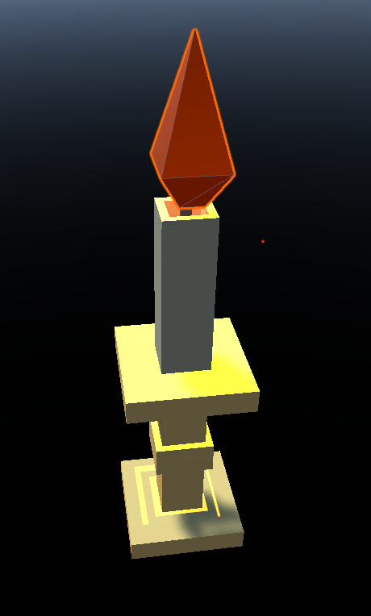
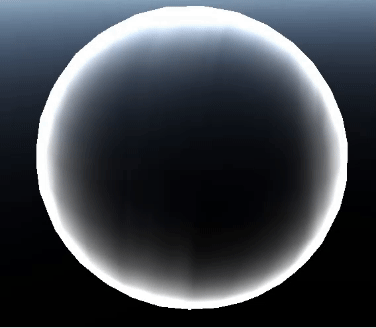

# Project 2 Report

Read the [project 2
specification](https://github.com/COMP30019/Project-2-Specification) for
details on what needs to be covered here. You may modify this template as you see fit, but please
keep the same general structure and headings.

Remember that you must also continue to maintain the Game Design Document (GDD)
in the `GDD.md` file (as discussed in the specification). We've provided a
placeholder for it [here](GDD.md).

## Table of Contents

* [Evaluation Plan](#evaluation-plan)
* [Evaluation Report](#evaluation-report)
* [Shaders and Special Effects](#shaders-and-special-effects)
* [Summary of Contributions](#summary-of-contributions)
* [References and External Resources](#references-and-external-resources)

## Evaluation Plan

**1. Objectives and Scope:**
   1. The purpose of this Evaluation is to present the game's current state to beta tests, gather feedbacks and insights from testers about graphics, gameplay mechanics, audio, storyline, controls and UI. In particular, we are interested to understand how players feel about environment, monster, and other elements, whether these contribute positively to game immersion, or offer insufficient engagement for players to be motivated to continue the game.
   2. furthermore, we wish to gather feedback on QOL improvement that could be implemented to enhance game feedback, sense of control, and direction to the player. In the current design, the game is open world without a direct line of progression that forces players to undertake a certain route, concerns arises whether players could successfully complete the game with minimal level of hints currently available. Or that without clear goals or directives, players would feel like a headless chicken, not knowing what to do.

**2. Evaluation Criteria:**
    
    As mentioned above, graphics, gameplay mechanics, audio, storyline, controls and UI are the main areas of focus.
   
 Graphics must satisfy the following quality,
   1. consistency - environment design is consistent in style, lighting, and fps remains stable throughout the game. 
   2. clarity - game is communiating clearly to the player what is happening in the game, players knows where to go, where they are, who is the enemy, and how much health they have
  
  Gameplay mechanics:
  1. clear goals and objectives: main goal and objectives are intutitve to underestand, players could quickly grasp what they needed to do.
  2. Rules - the rules of game is intutitive to understand, either intutively or explicitly told by in game hints. Rules explicited stated are strictly followed by gameplay mechanics
  3. leveling-up - the game is effective in introducing to the player how to level up, what they need to do, and what they will get.
  4. progression - the game is effective in communnicating to the player how it will progress, or expect what will happen if they pick a particular path.
  5. engagement - game is sufficiently engaging the players would want to continue playing.

  Audio:
  1. clarity - audio offers clear and easy to understand feedback of what happens in the game, players could rely on audio to re-confirm changes occured.
  2. immersion - BGM is suitable to the game scene, BGM adds environment vibes, and sense of pressure and urgency.

  Control:
  1. intitutive to use - controls follow RPG conventions, characters movements and abilities are clearly communicated to the player.
  2. expression space - controls offer sufficient room for player to show mastery, and maintain a level of variety.
  3. tools - game pause, exit game options are easy to use. Players knows how to access these tools.

  UI:
  1. clarity - UI is clear to communicate game state, character state. UI is non-intrusive, does not block player view, is not a hinderance to player control.
  2. practicality - UI offers practical help, including minimap, healthbar status, mana status, ability status.

**3. Evaluation Team:**
  - The evaluation team consist of 4 team members. Each with their unique responsibility.
  - A is responsible for conducting post-playthrough interview.
  - B is responsible for taking note during structured observation where participants would be invited to play the game without any guidance. The structure of the observation and interview will be mentioned in **Testing Methodologies**.
  - C is responsible for coding the notes and interviews answers obtained, and deriving themes and condensing issues from obtained material.
  - D is respsonible for compiling obtained result into a report, highlighting common issues, and formulate possible fixes to the issues highlighted.

**4. Recuriting Participants:**
   - There would be at least 7 participants for each evaluation technique, combining for a minimum of 14 participants. 
   - Recuritment methods can be snowball or direct advertising. However, recurited participants must form a pool that have somewhat equal gender balance, have age distribution similar to the gaming community, comes from a vareity of backgrounds, including but not limited to game design and graphics design.
   - Recruited participants would be rejected if they never played any RPG games; or if they are out side the age range between 14-60.
   - Participants will be asked to consent to being observed or recorded throughout their playthrough, participants will be asked whether they consent to having their recorded material and interview answers to be included in the evaluation report, data retained without consent for distribution would not be included in the evaluation report.

**5. Testing Methodology:**

  Evaluation would be conducted through one querying and one observational methods. The team have decided to use interview and structured observation to form the interview.
  
  **Structured observation :**

  this evaluation consist of instructing the participants to play through the game, the goal and the task will be explained to the player prior to starting the obseration. During the playthrough the participants must persist without any external hints or guidances from the observer.

  The observer will take notes on participants' experience with the game, as per evaluation criteria listed above. Areas where participants expressed particular dissatisfaction, or confusion are to be documented, reasons of which caused confusion can either be inferred from player reaction or complaints. Participants would be encouraged to voice their dissatisfaction outloud while they are playing the game. 

  **Semi-Structured interview :**
  
  Semi-structured interview consist of two part, the first is a set of predetermined set of questions to all participants in the same order on their experience with the initial playthrough. 
  
  The second part is a set of open questions on all aspects of the game, including but not limited to graphics, controls, environment setting, mechanics, storyling flow. The aim of these questions is to understand participant's insights on what they would have added or deleted from the game.

**6. Data Collection:**
   
   1. Video recording - we expect to obtain video recording of both the playthrough and the interviews, subject to the participant's consent. Recording may be included as part of material to the evaluation report should the participant consent for it to be distributed. Video recording is expected to be filmed on phone, on a fixed tripod, the recording, where possible, should include the participant playing the game, a side by side recording of the computer screen would start concurrently for retrospective analysis.

   2. Written notes - we expect to obtain written notes written by our evaluation team member generated through observing participants play the game. These notes will document observer's insights of participant's interaction with the game.

   3. Interview answers - we expect to have obtained interview answers from participants, these might be in the form of a physical note, digital word document or other medium.

   All data collected from the evaluation process will be converted to digial format wherever possible, they would be stored collectively on a UniMelb student google drive, consent to these data collection from the participants would be stored side by side to the obtained material. These material could include but not limited to txt, word document, voice recording, video recording, scanned copy of written notes etc.

**7. Analysis and Evaluation:**
   
   The game will be evaluated with criteria listed in **Evaluation Criteria**. Participants will be asked questioned regarding aforementioned elements.
   
   Coding would be applied to all textual response, common themes would be identified where significant number of participants reported issues. Problems would be aggregated into archtypes and subtypes which can faciliate designing solutions that can address these issues systematically rather than on a case by case basis. 
   
   Analysis is expected to be derived from quotes generated from participants' mention of issues regarding any elements in the game. For example, gameplay is overtly repetitve, where participants raise issues like not enough diverse character movements, not enough custom abilities etc, the development team would attempt to address the issue through first looking at how much space is avaliable for changes and reworks. Most importantly, trade offs should be carefully considered between participant suggestions that would alter game mechanics flavour beyond what was initially intended and the benefits implementing these changes would bring to players to better enjoy the game. Given the feedback, we aim to find the core issue that is causing pains to the game experience, and seeks to address them.

   Basic elements like replayability, engagement, interesting design etc will be rated through a Likert Scale from strongly disagree to strongly agree. The interview will ask participant whether they agree above elements are properly implemented in the game. Where a certain element consistently rated negatively among the participants, it would be subject to reworks. Direction of rework depends on participant feedback provided from open-ended questions in the interview.

**8. Post-Evaluation Activities:**
   - Redesign elements that are raised as significant difficulties or impediments to a fluid gaming experience. 
   - Trial implementation of altered designs, interal tests conducted by other team members, compare difference between two versions, if the benefit could be ascertained, the changes would be accepted and moved into final product.
   - Analyse which deisgn decisions contributed to creating the issue, changes to the design process could be implemented to avoid future repeition of similar problems.

**9. Timelines:**

Stage 1. Recuritment. Finish recruiting participants and filter out participants not suitable for this evaluation process. - Due 9th Oct.

Stage 2. Scheduling Sessions, scheduling available time with participant to begin playthrough. 

Stage 3. Began evaluation. Starting Structured Observation &  interviews with participants, gather participant consent when they accept scheduled time.

Stage 4. Filter results. Aggregate all results and feedbacks gathered from evaluation, began coding and analysing feedbacks.

Stage 5. Conclude evaluation process. Due 15th Oct. 

Stage 6. Compling report. List out areas subject for changes and fixes. Compiling Evaluation report. Due 15th Oct.

Stage 7. Implementing changes. Implement changes and play test changes, accept or reject changes depend on result. Due 20th Oct.

## Evaluation Report

### Introduction 
A series of observations and interviews were conducted to beta test the prototype game. A series of themes were identified as common problems that most if not all participants have experienced to some degree, we have categorized them into distinct topics each addressing a particular gameplay element. The root cause of each problem, including the origin of those problems were thoroughly explored in discussion, mitigation strategies were discussed in Opportunities, these solutions were to be tested in later iterations and tested to see whether they could adequately address the problem identified in this evaluation study.
Evidences
_____
### Observation:

#### Participant 1 playthrough
**Animation fluidity**: 
>“Animations are stuttering, they are not fluid at all”

participant find it difficult to get used to animations, sometimes they fail to cast spells because they are still swinging their sword.

**Animation consistency**: 
>“Attack is fast but dodging is so slow”

control seems difficult to get familiarized with due to its uneven stutters.

**Position awareness**: 
>“Where should I go?”. 

participants have a hard time understanding where they should go, and where they are.

**Event awareness**: 

>“what do I do now?” x3.  

Participants experienced some difficulties understanding the event flow of the game, 2mins into the game, the participant is not sure what they should be doing, or how the game is progressing, looks like they have no positive feedback telling them what they have been doing is right or wrong.

**Monotone gameplay**: 

>“Don’t know what I am doing.”

Participant is unsure what they are doing, or what they should be doing, and lack of direct instructions leads to mild anxiety.

_____
#### Participant 2 playthrough:
**Gameplay difficulties**: 
>“I don’t do any damage to it.” 

Participants expressed some exasperation at how minions overstat them when they actively run away from the minions, and found it difficult to damage them.

**Character controls**: 
>“I can’t run straight”

Participant found it difficult to precisely control character movement, in particular, 
_____
#### **Participant 3 playthrough**:
**Survival Difficulty**: 
>"How can I win, after all?" 

Players often find it challenging to survive in the early stages of the game. They discover that even when they escape to high ground, they cannot avoid the damage from long-range attacks, especially when they've depleted their energy and can't activate their shields or when their stamina is exhausted and they can't use it for energy recovery. It seems like there's no other choice but to face certain death.

**UI Delay**: 
>"The text prompts are so cluttered; I can't extract useful information from them, they're just bothering me." 

While the text prompts speed up their fading when they change frequently, it's still not enough to keep up with the game's progress, causing players to always be unaware of what's in effect at the moment and constantly distracted by the continuously refreshing old news.
_____
#### Participant 4 playthrough:

**Monotonous Experience**: 
>"The map is incredibly detailed, but players often don't need to leave their starting point to complete the game, making it difficult for players to continuously receive visual sensory stimulation and enjoy the game."

**Mechanics Instruction**: 
>"I had no idea how to use the skill the first time I tried it." 

The game's mechanics are only explained at the beginning, making it hard for players to remember.
_____
####  Participant 5 playthrough:
**Visual tips**: 
>"It's too dark in some areas." 

Participants mentioned that certain areas of the game were too dimly lit, making it difficult to recognize objects or paths. This often caused them to bump into obstacles or miss key items.

**Audio Feedback**: 
>"The sound is not synchronized with the actions." 

There is a noticeable delay or mismatch between the actions the character performs and the corresponding audio feedback. For example, the sound of a jump does not sound until after the character lands.

**Goal Clarity**: 
>"What is the main goal here?"

Participants were not clear about the overall goal of the game. They found themselves wandering aimlessly with no clear direction or purpose.

**Mechanism**: 
>"Combos are hard to perform." 

This participant had a hard time comboing in combat. They found the required inputs to be either not intuitive or not responsive enough, resulting in frequent interruptions in the flow of combat
_____
#### Participant 6 playthrough:

**Feedback Circuit**: 
>"I wish I knew if I was doing this correctly". 

Participants indicated that they would like more immediate feedback on their actions, especially when using abilities or interacting with game mechanics. This would help them determine if they are progressing correctly or if they need to make adjustments.

**Game progression**: 
>"It feels like I'm stuck in a cycle". 

Players felt that the game lacked clear progress markers and smooth navigation, making it difficult to determine if he were advancing the storyline or just repeating similar tasks.
_____
### Interview:
#### Participant 1:
>“I can’t tell the difference where the monster is coming from”. 

When asked about how sound design could be improved.
>“There should be more tips”. 

When asked where user experience could be improved in general.
_____
#### Participant 2:
>“The running sound is really noisy, … distracting”.

 When asked about how sound design could be improved.
>“I don’t know which buttons are which…” 

When asked about where UX could be improved in general. 
_____
#### Participant 3:

**Skill Imbalance**: 
>"The difference in strength between player skills is too significant. Some skills are overly powerful to the point where players can win the game with just that one move, while others have minimal impact considering the energy cost." 

When asked about improvements to player skills.

**Loud Monster Sound Effects**: 
>"Why are the monster's sound effects so noisy? They're constantly screeching the entire match. This doesn't immerse me at all; instead, it's annoying."

**AI Oddities**: 
>"The monsters' pathfinding sometimes stutters, and at other times, they move in the opposite direction, severely undermining the fun of combat,"

regarding enemy behavior.

_____
#### Participant 4:
**Value of Items**: 
>"Is it really worth my time to pick up items like health potions when I have thousands of attack power? +1?" 

The player complains about item health potions.
**Too many Skill**: 
>"The skill on the G key is quite interesting; it bounces between enemies, but it is kinda of hard to keep track of dmg it does to every enemy"
>"But this ability is too imbalanced where I only need to keep using it to quickly reach the maximum level."

when evaluating the skill system. 
_____
#### Participant 5:
>“It feels repetitive, I’m just doing the same thing over and over”.
>I kept getting lost in the same area multiple times, I wish there were more landmarks or signs to guide me in the whole map.

Players felt that the gameplay lacked variety, leading to a feeling of monotony. 

_____
#### Participant 6:
>"I often get lost in dark areas, hoping for brighter indicators or signs." 

Players feel a loss of direction in certain dimly lit parts of the game.
>"I've collected some items, but I don't know their purpose." 

Players express that they wish the items had clearer descriptions or usage hints.
>"If the game had more storylines or character interactions, I think I'd be more engaged." 

Players hope the game offers more than just combat, looking for elements that can enhance immersion.
______________________________

### Findings & discussions.
#### Animation consistency
Participant 1 thinks animations are not consistent, some animations are rendered quicker than others, this creates a disparity between participant expectation and reality of how to chain attacks. Discrepancy between animation speed of various attack and spells animation makes it hard for participants to tell what they have just done, the lack of UI feedback to confirm whether their latest commands have indeed had a physical impact in the game world is vital to diminish the gulf of execution for participants. Having clear and obvious animation carried through is critical for participants to confirm they are indeed in control.

#### Animation fluidity:
Participant 2 expressed disappointment at the animation fluidity. The player model seems to unexpectedly stagger in between animation transitions. Participants are often confused as to why animations have such different stagger time, why transitions are not as fluid as they expected, this destroys immersion, since participants have to constantly look at what the character is doing, rather than focusing on what is happening around them. This distraction is not helpful to facilitate a smooth gameplay experience.

#### Minions & battle strategies:
Participants are generally unaware that running away from minions is not a good option, that health and attack of minions scales with time as opposed to with player’s level, this contributes negatively to gameplay experience. Since explicit warnings are not present in the current iteration of the game, players have to playthrough the second time to formulate a better strategy. While this is creating additional mental load to the player, it does not seem to be detrimental to players who really want to finish the game, but may discourage players who are less experienced or enthusiastic about the game.

#### Gameplay progression:
We discovered that while participants understand they have to survive the game, there are little motivations for them to fight the minions, most would opt to run away, which does not help them to obtain sufficient levels & stats to face off against the final boss. The design team concluded that since there is no alternative way for the players to finish the game other than to fight the boss, progression seems monotonous and restrictive. Which is not suitable to the ‘open world’ setting we gave to the general level design. 

### Opportunities & Problem Analysis
####  Consistency of animation:
Animation consistency or animation consistency can significantly affect player immersion and game flow. Participant 1 highlighted problems associated with different animation speeds that can undermine expectations. Consistent animation plays a key role in ensuring that players feel a seamless connection between their commands and game reactions. Solving this problem requires strengthening the game's feedback mechanism, which means having a more responsive UI. This may take the form of subtle vibrations, sound effects, or visual cues. Second, games can benefit from a standardized animation speed that resembles action, which would instill predictability in gameplay. Finally, user testing as a consistent practice is critical. Feedback from end users can help us identify overlooked usability issues and guide iterative improvements to the game.

####  Minions & Battle Strategies:
Understanding the mechanics of combat, especially with regard to minions, is crucial to strategic gameplay. At the moment, players don't seem to be aware of the minions' scaling mechanics, rendering the strategy ineffective. This knowledge gap can have a negative impact on the gaming experience. Solving this problem requires introducing a clear tutorial that clarifies the scaling mechanism of the minions. In addition, providing in-game cues can guide players to effective strategies and remind them of the consequences of their choices. After a player has failed, it is useful to analyze the feedback mechanism of their strategy. This feedback guides players to refine their approach, ensuring that they learn from their mistakes.

#### Progression and Feedback Circuit:
Several participants mentioned feeling uncertain about their progress in the game or expressed a desire for more immediate feedback. This suggests a need for a more transparent progression system or feedback mechanisms that help players understand if they are on the right track. Addressing this issue can improve player engagement and satisfaction.

#### Audio Feedback:
Participant 5 mentioned that the sound effects were not synchronized with the character's actions. This indicates a potential problem with audio feedback in the game, which could affect the overall gaming experience. Improving audio feedback synchronization can enhance immersion and gameplay quality. To address this issue, We implement audiovisual alignment tools: tools deployed in the game engine to ensure that sound effects and character movements are synchronized. These tools can identify differences in real time, allowing developers to make adjustments immediately. Sound effects are important feedback for player actions. Their synchronization with the in-game action ensures that players receive consistent and accurate feedback, enhancing immersion and a sense of reality.

#### Visual Tips:
Participant 5 pointed out that certain areas of the game were too dark, making it challenging to navigate and recognize objects. This suggests that visual cues or lighting in the game might need improvement. Enhancing the visual aspects of the game to provide better guidance and visibility could lead to a more enjoyable experience for players. In order to address this issue, Added torch placement, although many torches were added in the castle scene, optimizing their placement and light intensity was essential. We ensure that these torches are strategically positioned to illuminate critical paths and objects, aiding navigation and object recognition. While torches provide a certain atmosphere and beauty to the castle, their primary function is to help players improve their visibility.

#### Goal Clarity:
Participant 5 also expressed uncertainty about the game's main goal, indicating a lack of clarity in the game's objectives. Ensuring that players have a clear understanding of their goals and objectives can enhance their sense of purpose in the game and reduce frustration.

#### Mechanism and Combos:
Participant 5 mentioned that combos were challenging to perform, with inputs being unintuitive or not responsive enough. This highlights potential issues with the game's mechanics and combat system. Improving the clarity and responsiveness of in-game mechanics, such as combo systems, can lead to a more satisfying gaming experience.

_____
### Mitigation & Solution: 

**Animation consistency**:

Regarding animition consistency, we have reworked the animator entired, before, any animation could be prematurely exited and transition into the next animation could began almost immediately, we think reworking some animation to be indisruptable could solve this issue, some spell castings, and running and attacking animation would no longer be interrupable should provide more animation fluidity to the game.

**Minions & Battle Strategies**:

We think reworking the number of minions that could exist at once would reduce the likelihood of players bcoming swarmed, reducing the frequency of which they are spawned can also help with improving survivability by reducing the chance that players would be blocked from moving between rooms.

**Audio Feedback**:

Monster spawn noise was supposed to be warning to players that monsters are spawning, however we did not anticipate this would be aggressively annoying for player, to address this, we could shrink the fallout distance to massively reduce the loudness of the noise from monsters that are spawned further away from the player. This should help for players to differentiate between monsters spawning immediatly next to them vs those that are further away.

**Progression**:

By reworking experience required to level up, and making the experience curve linear, we could reduce the mental load to the player by making the amount of monsters that player must kill before they can level up relatively constant throughout the gameplayer, this should make progression easier to understand.

## Shaders and Special Effects

### **Custom 1. Particle Effect - Candle Flame** 

In this game, shaders applied to objects and ability special effects are mostly imported material from packages source from unity's store. Except three, where it was custom written for this assignment to bring a sense of liveliness to the game. 

### Final Effect:

  

Prefab using this particle system: **[SM_Prop_CandleFlame_with_light.prefab](https://github.com/COMP30019/project-2-infinitegame-studio/blob/main/Assets/GameEnvironment/Castle/Prefabs/SM_Prop_CandleFlame_with_light.prefab)**

Tutorial URL: [Atomospheric Candles in unity](https://www.youtube.com/watch?v=EKo1SLQD9KI), The idea to use particle system instead of writing a separate custom shader to simulate candle flame is taken from this tutorial, additional tweaks were applied in this implementation to enhance the effect.

Material used: **[Candle_flame_2](https://github.com/COMP30019/project-2-infinitegame-studio/blob/main/Assets/GameEnvironment/Castle/Materials/Candle_flame.mat)**

Particle System settings: **[SM_Prop_CandleFlame_with_light.prefab](https://github.com/COMP30019/project-2-infinitegame-studio/blob/main/Assets/GameEnvironment/Castle/Prefabs/SM_Prop_CandleFlame_with_light.prefab)** - start @ Line 69.

The candle flame prefab imported from Simple Fantasy interior is a static object. While the candle tip itself is configured to glow, compounded with strong point light, the candle itself is very nicely done. However, the candle flame itself is still a static object that does not move, which was a bit lacking, given that candle is the most widely used lighting source utilitised in the game, we thought to give it a bit flair adds to the detail of the game.

    
   

The least resource draining method that we can implement is to have a static flame image hollowed out, set to move about rapidly within a small boundary. This would create the illusion that a live flame is burning. The particle system regulates the boundary, frequency, shape, velocity, colour, and rendering mode. Using the flame img from below as a standalone particle, have a tight and small spread of flames that moves vertically upwards creates the illusion of a live flame. Additionally, set the particle to shift its colour from yellow to red to improve realism.

**Particle system attributes**: \
Start lifetime: 0.5 \
Start Speed: 0.05 \
Start Size: Random beteween: 0.02 - 0.1 \
After considerable experimentation, this set of parameters results in flame that is not too long, not too wide. Start lifetime works with vertical movement, limits its potential vertical movement. Having a start size that is randomised creates a vibrant flame that changes its size over time.\
**Shape**: box \
Position: 2.1102e-06, -0.00053324, 1.14e-08 \
Scale: 0.0097, 0.0123, 0.004 \
A box shape adds some spread to the flame, creates the illusiont that the flame is waving slightly. Scaling was applied to ensure that the spread is not too big, control it tightly around candle wick.\
**Velocity over lifetime**: Speed modifier: 1 \
**Limit Velocity over lifetime**: Speed: curve: dampen: 0.2 \
By reducing its velocity before it sets to disappear, the residual particles would stack creating a deeper red.\
**Colour over lifetime**: yellow to red \
The original image is bright yellow, having it shift colour from yellow to red over lifetime can produce the distinct flame tip at the top more vividly. \
**Size over lifetime**: Size 1.3 to 0.2 \
Initially size over lifetime was set to constant, this proves too stale, where images of the size stacks on top of one other, was rather repetitive. \
**Renderer**:  \
Renderer mode: Vertical billboard \
This makes the flame img to move in a vertical line, setting direction to 1 makes it move upwards.

**Material Attributes**: \
Rendering mode: Additive \
Colour Mode: Multiply \
Additive rendering mode would not introduce the background of the flame image, causing unwanted residual from the source image; colour mode set to multiply produce the desired output of flame colour transition.

  

Above is the root image for this flame.

The particle system is set to have a tight small box shape, emits from the candle wick, the flame image moves vertically before shortly disappear. Have a box shape creates a spread using a random seed, which allows the tip of the expiring image that have turned red to have some differentiation from other copies of itself.

This implementation requires primarily vertex calculation for vertical movement calculation, and Pixel Shader calculations for colour over lifetime adjustments. Since this particle system is not expected to have physical interaction with any other object, its emitor mode could be set to **Transforms** rather than **rigid body**, this could further reduce computation load.

_____
### **Custom 2. Shader - Fireplace** 
### Final Effect:

  

Prefab using this shader: **[fireplace](https://github.com/COMP30019/project-2-infinitegame-studio/blob/main/Assets/GameEnvironment/Castle/Prefabs/Fireplace.prefab)**

Shader used: **[flame_shadow](https://github.com/COMP30019/project-2-infinitegame-studio/blob/main/Assets/GameEnvironment/Castle/Shader/flame_shadow.shader)** - this creates the flame that changes colour over time, and moves occassionally upwards.

Shader used: **[yellow_flame](https://github.com/COMP30019/project-2-infinitegame-studio/blob/main/Assets/GameEnvironment/Castle/Shader/yellow_flame.shader)** - this creates the flame in the center, that moves side by side.

This flame is a composite of multiple flames stacked on top of one another, it is an approximation that would not significantly strain the system. At earlier development stages, the framerates was abysmally low, we intended to have a live flame imported from somewhere else that would emulate a burning fire that would occassionally spits out bits of fire at the player, painted in blue, like a ghost flame. However, the burden to the framerate at that time proved this solution was non-viable, therefore, the task was to simulate a flame using minimal animations and particle generation. 

This shader implements two simple functionalities, transformation and colour change over time. Having the time moves by sine or cos waves proved too predictable and strange for a fire, therefore we opted for a tan curve. This creates additional problems like clipping through the firepalce at times, which was mitigated, somewhat, by reducing the range of movement, and tuning the speed to be faster, the probability where the flame would clip through the fireplace is greatly reduced.

This shader is used to animate the fireplace flame for prefab [fireplace](https://github.com/COMP30019/project-2-infinitegame-studio/blob/main/Assets/GameEnvironment/Castle/Prefabs/Fireplace.prefab). Each fireplace's flame is constructed with 4 different flame, 2 red glowing static flame, 1 animated yellow flame, and 1 colour changing animated flame. The fireplace is the main light source in most rooms, having a dynamic fixature would bring a sense of liveliness to the room.

Since this shader is a composite construct, each flame is rendered in different way. The static flames needs only to calculate its geometry from local space and translated into world space, for animated flames, renderering is slightly different, for each frame, its vertices must first be recaluated, tesselation applies triangles to the surface. The object's geometry calculated, then translated from local space into world space, its colour transition would be calcuated last, before the final product moved into output buffer.

_____
### **Custom 3. Shader - Shield** 

  

Prefab using this shader: **[jzz2](https://github.com/COMP30019/project-2-infinitegame-studio/blob/main/Assets/Resources/Prefab/Skills/JZZ2.prefab)**

Shader used: **[Shield.shader](https://github.com/COMP30019/project-2-infinitegame-studio/blob/main/Assets/GameEnvironment/Castle/Shader/shield.shader)**

Texture used: **[Shield_flow.png](https://github.com/COMP30019/project-2-infinitegame-studio/blob/main/Assets/GameEnvironment/Castle/Textures/shield_flow.png)** - This is the texture used on the shield.

Shielding is a critical component of gameplay in our design, since players will likely be taking damage from their battles continously, given the lack of breathing room for the player to use zen mode to help, shielding becomes critical in improving survivability.
The old shield design uses the "default particle" as the texture for the shield, we thought that design was too simplistic, thus we thought to add more flavour to the shield once the player hit a certain level, signifying an improvement protection and survivability.

The shield uses three main component, the fresnel effect around the edge, rotation matrix, and a custom created texture, each was learned from a different tutorial throughout the game development process creating different prefabs. The fresnel effect was learned from [this tutorial](https://www.youtube.com/watch?v=nuoQdbJwAHo&t=534s), this creates the fresnel effect around the effect, regulated by the **_FresnelIntensity** and **_FresnelRamp** variables which controls the strength and transition on the edge. The fresnel effect is achieved by calculating the unity object's normal in world space relative to the camera, the surface with normal that are pointing at a direction more perpendicular to the camera normal are enhanced with stronger light, the distance from the edge to the center to apply colour with can be adjusted using **_FresnelRamp**, the colour intensity can be adjusted by **_FresnelIntensity** respectively. During rendering, the rotation of the spheric shield is first calculated, object surface normal is then drived allowing for frag to take this matrice to calculate where to strengthen colour on the sphere. 

The rotation matrix was learned from [this tutorial](https://gist.github.com/baba-s/b46396a8c92f1f4e5e011b1dd20e3a4d) when trying to learn how to create a spinning magic circle for spell casting, this rotation matrix allows the object to rotate around a axis, modifying this by adding _RotationSpeed variable to control the speed, and changing speed relative to (_Time.y,: since level loaded) unscaled time instead of a fixed angle creates a more stable effect, further modifying the rotation matrix allows for a more distorted, non-linear transformation of the sphere object, which in turn creates a wind effect around the shield. 

While wraping a premade hex shield texture was proving to be not fitting with the setting, we opted for the trail texture learned from creating the [trail.shadergraph](https://github.com/COMP30019/project-2-infinitegame-studio/blob/main/Assets/GameEnvironment/Castle/Shader/trail.shadergraph) from [Stylized Trail Tutorial](https://www.youtube.com/watch?v=wvK6MNlmCCE), using photoshop to duplicate the trail texture, when applied to across the shield surface, it looks like wind surrounding the shield. 

Where static colour was too simplistic, we created a ripple effect where the colour would transition gradually from filled to transparency. The transition is controlled by **_RippleStrength** which controls light strength, **_RippleSpeed** controls the speed/frequency of transition. 

Rending the shield is relatively straight forward, the game calls the shield by invoking the particle system and creating a shield particle, its surface is textured and colour by material created by shield.shader. The shield rotates according to configuration set in vert, while it looks like that the shield is rotating wihuot a pattern, this is because all three axis are rotating at the same time.

_____

## Summary of Contributions

YongChun Li:

1. Building player behavior, monster behavior, projectile and skill frameworks, item interactions, delayed special effects bars, and timing management.
2. Defining various interfaces and coding standards, including object pooling, icon visibility, damage interfaces, and freezing interfaces. Developing a strategy template class for instant-acting items. Developing a component for handling numerical curves.
4. Managing background music, skill sound effects, and custom skill effects. Developing sound management systems and state machine music scripts. Collaborating with game design to plan skills, expected game effects, and balance adjustments.
5. Designing and implementing unique core skills "ZenMode" and "Autophagy (Mind Control)."
 

YuXin Ren:
1. Game character: Sourced model & Assembled character assets
2. Particle system （flames in the fireplace）
3. Game scene: Winning/Losing Scene & Button
4. Game balance: participated in Story lines & Game levels & Character Progression

Rong Zhao:

1. Game Environment: Skybox & BGM
2. Game UI: Start & Win scene, pausemenu
3. Documentation: Evaluation report

Zekai Qian:

1. Shader: shield design & implementation, fireplace design & implementation, candle design & implementation.
2. Game Environment: Castle layout & implementation
3. Documentation: Evaluation plan & evaluation report; Shader Documentation
4. Made critical improvements to animation smoothness fixes.

____
## References and External Resources

### External Resources
#### Prefab packages 
1. [Simple Fantasy Interiors - Cartoon Assets](https://assetstore.unity.com/packages/3d/environments/fantasy/simple-fantasy-interiors-cartoon-assets-76478): Bought from unity asset store.
2. [Low Poly Dungeons](https://assetstore.unity.com/packages/3d/environments/dungeons/low-poly-dungeons-176350): Bought from unity asset store.
3. [Lowpoly Castle Dungeon Tileset](https://assetstore.unity.com/packages/3d/environments/dungeons/lowpoly-castle-dungeon-tileset-195730): Bought from unity asset store.
4. [FREE Slavic Medieval Environment](https://assetstore.unity.com/packages/3d/environments/fantasy/free-slavic-medieval-environment-town-interior-and-exterior-167010): Bought from unity asset store.
5. [Modular Fantasy Castle pack - demo](https://assetstore.unity.com/packages/3d/environments/modular-fantasy-castle-pack-demo-189505): Bought from unity asset store.

#### Music
1.  BGM: /Assets/Resources/Music/final_boss.mp3: [Apocalypse](https://pixabay.com/music/build-up-scenes-apocalypse-128378/) -  Downloaded from Pixabay.com
2. /Assets/Resources/Music/haunted_house.mp3: [Haunted house ambiance](https://cdn.pixabay.com/download/audio/2022/03/01/audio_d7675feb0e.mp3?filename=haunted-house-ambience-21831.mp3&g-recaptcha-response=03AFcWeA4SS0BKySkEQlWcWQIc9-WL38gdlTAIvJdXO98lz4iSALoI2QDNGk3a8HgLup4Sc0yvFtK1dd29pqEzV0fReaCtXkCeW_gu_PNpe0M1tprbhwMwsVWG8krtRYZM0u7p3NiAjvwzfxsqBxZEEvB4jGdTRpJqLJPmC3PYQK8qt56O26QyutP20b2IokXKTcHgxKA4JbNhwyXk9foRFKimXXKkdMKzMbUyHeeshXUIBFUCQLCSqEcorrePnyI1JX6kbjjpplMM6DSERzuftSfebNyui0GZfSjtBevwMR3ShhKaDJnIMt-uhttGqM1RLZo3QimDs1rDchhzBsjWwAC7CIc-5-y3fy926b1_xEM4DVUWcn1L8Dqf6oJwi6m1ZutkFOwT7fEijr0u8GPTILM-jQcDfDHRIiWQP_IF5QucibxQjcEwf7iMfRnxc_paG4-ICh6uSiq1QyMefVRC11uGljNMqvj-5qeuDCXvU4kk2Fs6kIrPU6hOnBFnyAfFfHovVLSNPUjb0AyUk8JquAmlptmwFKXKXQ&remote_template=1) - Downloaded from Pixabay.com

#### Resources involved in program development and descriptions of their use ###

**Monster and Boss Models**
- Monster and Boss models are available at this [link](https://assetstore.unity.com/packages/3d/characters/creatures/monster-4-low-poly-208684). The built-in animator functionality has been deprecated. Existing animations are sourced from Mixamo ([link](https://www.mixamo.com/), following links omitted). We have independently compressed and processed the textures to suit low-performance platforms.

**Player Character Model**
- The player character model can be found [here](https://assetstore.unity.com/packages/3d/characters/humanoids/fantasy/swordsman-170111#content). It exclusively utilizes the model with animations sourced from Mixamo, while the animator is entirely self-developed. This material does not provide any code; all player scripts have been developed in-house. We've also independently compressed and processed textures to ensure compatibility with low-performance platforms. The internal hierarchy structure has been adjusted accordingly.

**Player's Sword**
- The player's sword model can be found [here](https://assetstore.unity.com/packages/3d/props/weapons/demonic-sword-222519). It solely utilizes the model, and the "Sword" script is self-implemented, primarily for real-time attack detection relying on collision checks.

**Monster Health Bar - Code Monkey: Health System (Includes Learning Video)**
- For the monster's health bar, we've utilized the Code Monkey's Health System available [here](https://assetstore.unity.com/packages/tools/utilities/health-system-includes-learning-video-211787). The code involves IGetHealthSystem, HealthSystem, HealthSystemComponent, with some elements being modified. This primarily pertains to health bar smoothing and the addition of one-time setting to full functionality. State bars for entities other than the player also employ graphical assets from this package, but their specific functionalities are managed by our self-developed code, including EffectTimeBarUI and EffectTimeManager.

**target-indicator**
- The "target-indicator" is used for displaying the boss's orientation. This material provides code located under UI.OffScreenIndicator, with some partial rewrites. Mainly, these modifications address the issue of delayed screen size updates for drawing areas and attempts to implement more in-game text hints. Color changes over time for controlled monsters were also explored but ultimately not applied due to performance considerations. Secondary development involves Indicator, OffScreenIndicator, Target, and OffScreenIndicatorCore, with direct application of BoxObjectPool and ArrowObjectPool. You can find this material [here](https://assetstore.unity.com/packages/tools/gui/off-screen-target-indicator-71799).

**TextMeshPro**
- TextMeshPro is a Unity built-in component used for informational prompts and displaying text in certain scenes.

**Low Poly Food Lite Models (Food, Damage-Boosting Knife, Frying Pan, and Plate)**
- Low Poly Food Lite assets are used for pickable items and have been combined into existing items by our development team. You can find them [here](https://assetstore.unity.com/packages/3d/props/food/low-poly-food-lite-258693).

**Spell Effects**
- Some visual particle effects within spell prefabs make use of the majority of effects from the "ky-magic-effects-free" package. However, all in-game effects for the spells themselves are self-developed. You can find these effects [here](https://assetstore.unity.com/packages/vfx/particles/spells/ky-magic-effects-free-21927).

**Player's Bottom Left Avatar, Health Bar, and Mana Bar Display**
- The game utilizes art assets and prefab structures from "rpg-unitframes-1-powerful-metal-95252." The logic for displaying health and other information is self-developed. This material does not provide any code. You can find these assets [here](https://assetstore.unity.com/packages/2d/gui/icons/rpg-unitframes-1-powerful-metal-95252).

**Particle Ribbon**
- Particle Ribbon is employed for particle effects in upgrades, attribute enhancements, health and mana restoration, freezing spell casting, player freezing, monster deaths, and other special effects. While there are minimal secondary developments, mainly concerning size, effect adjustments, and color changes, this package was not significantly modified. Related scripts such as ParticleEffectManager are self-developed. You can find Particle Ribbon [here](https://assetstore.unity.com/packages/vfx/particles/spells/particle-ribbon-42866).

**Game Sound Effects and Some Music**
- The game sound effects and some music are sourced from the game "New Swordsman" by Xishanju. The materials used are from online sources and are exclusively for educational purposes. As the game was released around 2000, specific links are no longer available. A Wikipedia entry on the game can be found [here](https://zh.wikipedia.org/wiki/%E5%89%91%E4%BE%A0%E6%83%85%E7%BC%98%E7%B3%BB%E5%88%97).

### Other ###
**Stylized Game Intro Image**
- The stylized game intro image was generated by [SeaArt.ai](https://www.seaart.ai/) under our guidance.

**Most Skill Icons**
- The skill icons used in the gamescene can be found [here](https://assetstore.unity.com/packages/2d/gui/icons/basic-rpg-icons-181301#content).

**Game Logo**
- The game logo(Chinese character) was generated by [shufaziti](https://shufaziti.com).

**Game Cursor and Crosshair**
- The Game Cursor and Crosshair was found in[Overwatch](https://overwatch.blizzard.com).

**Sprint Icon**
- The sprint icon was found in [Honor of Kings](https://pvp.qq.com/).

<!-- **Portrait of Xianzhong Zhang**
- The image of Xianzhong Zhang is sourced from an anonymous user on Xiaohongshu (Little Red Book). Xianzhong Zhang, being a historical figure, does not possess portrait rights. -->

